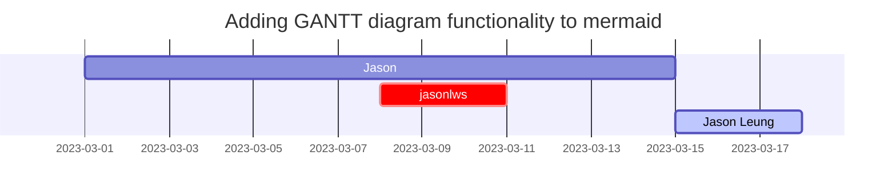

## Learning From [markdownguide.org](https://www.markdownguide.org)

### What is Markdown?

> Markdown is a lightweight markup language that you can use to add formatting elements to plaintext text documents. Created by John Gruber in 2004, Markdown is now one of the world’s most popular markup languages.
>
> Using Markdown is different than using a WYSIWYG editor. In an application like Microsoft Word, you click buttons to format words and phrases, and the changes are visible immediately. Markdown isn’t like that. When you create a Markdown-formatted file, you add Markdown syntax to the text to indicate which words and phrases should look different.
>
> For example, to denote a heading, you add a number sign before it (e.g., # Heading One). Or to make a phrase bold, you add two asterisks before and after it (e.g., **this text is bold**). It may take a while to get used to seeing Markdown syntax in your text, especially if you’re accustomed to WYSIWYG applications. The screenshot below shows a Markdown file displayed in the Visual Studio Code text editor.
>
> You can add Markdown formatting elements to a plaintext file using a text editor application. Or you can use one of the many Markdown applications for macOS, Windows, Linux, iOS, and Android operating systems. There are also several web-based applications specifically designed for writing in Markdown.
>
> Depending on the application you use, you may not be able to preview the formatted document in real time. But that’s okay. According to Gruber, Markdown syntax is designed to be readable and unobtrusive, so the text in Markdown files can be read even if it isn’t rendered.
>
>> The overriding design goal for Markdown’s formatting syntax is to make it as readable as possible. The idea is that a Markdown-formatted document should be publishable as-is, as plain text, without looking like it’s been marked up with tags or formatting instructions.

### Why Use Markdown?

> You might be wondering why people use Markdown instead of a WYSIWYG editor. Why write with Markdown when you can press buttons in an interface to format your text? As it turns out, there are several reasons why people use Markdown instead of WYSIWYG editors.
> 
> - Markdown can be used for everything. People use it to create websites, documents, notes, books, presentations, email messages, and technical documentation.
> 
> - Markdown is portable. Files containing Markdown-formatted text can be opened using virtually any application. If you decide you don’t like the Markdown application you’re currently using, you can import your Markdown files into another Markdown application. That’s in stark contrast to word processing applications like Microsoft Word that lock your content into a proprietary file format.
> 
> - Markdown is platform independent. You can create Markdown-formatted text on any device running any operating system.
> 
> - Markdown is future proof. Even if the application you’re using stops working at some point in the future, you’ll still be able to read your Markdown-formatted text using a text editing application. This is an important consideration when it comes to books, university theses, and other milestone documents that need to be preserved indefinitely.
> 
> - Markdown is everywhere. Websites like Reddit and GitHub support Markdown, and lots of desktop and web-based applications support it.

---
## Basic Syntax

All Markdown applications should support following elements:

### Text

| Element| Markdown Syntax| Display|
|:---|:---|:---|
| Bold | `**Bold Text**` | **Bold Text**|
| Italic | `*Italic Text*` | *Italic Text*|
| Bold and Italic | `***Bold and Italic Text***` | ***Bold and Italic Text*** |
| Strikethrough | `~~Strikethrough Text~~` | ~~Strikethrough Text~~|
| Highlight | `==Highlight Text==` | <mark>Highlight Text</mark>|
| Subscript | `H~2~O` | H<sub>2</sub>O|
| Superscript | `X^2^` | X<sup>2</sup>|
| Code | <code class="language-plaintext highlighter-rouge">`Code Text`</code> | `Code Text` |
| Emoji [list](https://github.com/ikatyang/emoji-cheat-sheet) | `Keep the fingers crossed :crossed_fingers:` | Keep the fingers crossed :crossed_fingers: |

---
### Lists

| Element| Markdown Syntax| Display|
|:---|:---|:---|
| Ordered | 1. First item<br>2. Second item<br>&emsp;1. Indented item<br>&emsp;2. Indented item<br>3. Thrid item | 1. First item<br>2. Second item<br>&emsp;1. Indented item<br>&emsp;2. Indented item<br>3. Thrid item |
| Unordered | - First item<br>+ Second item<br>* Third item | &#9679; First item<br>&#9675; Second item<br>&#9632; Third item |
| Description | Jason Leung<br>:&nbsp;The Author | <b>Jason Leung</b><br>&emsp;The Author |

---
### Links

| Element| Markdown Syntax| Display|
|:---|:---|:---|
| Automatic URL | `https://www.jasonlws.com/` | <a href="https://www.jasonlws.com">https://www.jasonlws.com/</a> |
| Disabling Automatic URL | <code class="language-plaintext highlighter-rouge">`https://www.jasonlws.com/`</code> | https://www.jasonlws.com/ |
| URL with Title | `[jasonlws](https:///www.jasonlws.com/)` | [jasonlws](https:///www.jasonlws.com/) |
| URL with Image | `[](https://www.jasonlws.com/)` | [](https://www.jasonlws.com/) |
| Email | `<jason.leung.ws@gmail.com>` | <jason.leung.ws@gmail.com> |

---
### Headings

<table>
  <thead>
    <tr>
      <th style="text-align: left">Element</th>
      <th style="text-align: left">Markdown Syntax</th>
      <th style="text-align: left">Display</th>
    </tr>
  </thead>
  <tbody>
    <tr>
      <td style="text-align: left">Heading Level 1</td>
      <td style="text-align: left"><code class="language-plaintext highlighter-rouge"># Heading Level 1</code></td>
      <td style="text-align: left"><h1 class="no-anchor" data-toc-skip="" id="heading-level-1">Heading Level 1</h1></td>
    </tr>
    <tr>
      <td style="text-align: left">Heading Level 2</td>
      <td style="text-align: left"><code class="language-plaintext highlighter-rouge">## Heading Level 2</code></td>
      <td style="text-align: left"><h2 class="no-anchor" data-toc-skip="" id="heading-level-2">Heading Level 2</h2></td>
    </tr>
    <tr>
      <td style="text-align: left">Heading Level 3</td>
      <td style="text-align: left"><code class="language-plaintext highlighter-rouge">### Heading Level 3</code></td>
      <td style="text-align: left"><h3 class="no-anchor" data-toc-skip="" id="heading-level-3">Heading Level 3</h3></td>
    </tr>
    <tr>
      <td style="text-align: left">Heading Level 4</td>
      <td style="text-align: left"><code class="language-plaintext highlighter-rouge">#### Heading Level 4</code></td>
      <td style="text-align: left"><h4 class="no-anchor" data-toc-skip="" id="heading-level-4">Heading Level 4</h4></td>
    </tr>
    <tr>
      <td style="text-align: left">Heading Level 5</td>
      <td style="text-align: left"><code class="language-plaintext highlighter-rouge">##### Heading Level 5</code></td>
      <td style="text-align: left"><h5 class="no-anchor" data-toc-skip="" id="heading-level-5">Heading Level 5</h5></td>
    </tr>
    <tr>
      <td style="text-align: left">Heading Level 6</td>
      <td style="text-align: left"><code class="language-plaintext highlighter-rouge">###### Heading Level 6</code></td>
      <td style="text-align: left"><h6 class="no-anchor" data-toc-skip="" id="heading-level-6">Heading Level 6</h6></td>
    </tr>
  </tbody>
</table>

---
### Table

```markdown
| First Column | Second Column | Third Column |
| :--- | :----: | ---: |
| Left| Center| Right|
```

Display:

| First Column | Second Column | Third Column |
| :--- | :----: | ---: |
| Left| Center| Right|

---
### Horizontal Rule

```markdown
---
```

Display:

---

---
### Images

#### Image

```markdown

```

Display:


#### Image with caption

```markdown

*It is a J icon*
```

Display:


_It is a J icon_

---
### Footnotes

```markdown
If you think you can, you can. And if you think you can't, you're right.[^bestquote]
##### Reverse Footnote
[^bestquote]: By Henry Ford
```

Display:

<p>If you think you can, you can. And if you think you can't, you're right.<sup id="fnref:bestquote" role="doc-noteref"><a href="#fn:bestquote" class="footnote" rel="footnote">1</a></sup></p>
<h5 class="no-anchor" data-toc-skip="" id="heading-level-3">Reverse Footnote</h5>
<div class="footnotes" role="doc-endnotes">
  <ol>
    <li id="fn:bestquote" role="doc-endnote">
      <p>By Henry Ford&nbsp;<a href="#fnref:bestquote" class="reversefootnote" role="doc-backlink">↩</a></p>
    </li>
  </ol>
</div>

---
### Task List

Markdown Syntax:

```markdown
- [x] Task 1
  + [ ] Subtask 1.1
- [ ] Task 2
  + [x] Subtask 2.1
```

Display:

- [x] Task 1
  + [ ] Subtask 1.1
- [ ] Task 2
  + [x] Subtask 2.1

---
### Blackquotes

#### Blackquotes with single paragraphs

Markdown Syntax:

```markdown
> If you think you can, you can. And if you think you can't, you're right.
```

Display:

> If you think you can, you can. And if you think you can't, you're right.

#### Blackquotes with multiple paragraphs

Markdown Syntax:

```markdown
> If you think you can, you can. And if you think you can't, you're right.
>
> By Henry Ford
```

Display:

> If you think you can, you can. And if you think you can't, you're right.
>
> By Henry Ford

#### Nested Blackquotes

Markdown Syntax:

```markdown
> If you think you can, you can. And if you think you can't, you're right.
>> By Henry Ford
```

Display:

> If you think you can, you can. And if you think you can't, you're right.
>> By Henry Ford

---
## For Chirpy Jekyll Theme

Jekyll is a static site generator that takes Markdown files and converts them to a website. Jekyll is a free and open-source application written in the Ruby programming language. Thousands of websites rely on Jekyll to convert Markdown source files to HTML output. GitHub Pages uses Jekyll as the backend for its free website creation service.

### Images

#### Image with size

```markdown
{: width="64" height="64" .normal}
```

Display:

{: width="64" height="64" .normal}

#### Image with float

```markdown
{: width="64" height="64" .w-50 .normal}
It is a J icon
```

Display:

{: width="64" height="64" .w-50 .normal}
It is a J icon

---
### Prompts

```markdown
> An example showing the `tip` type prompt.
{: .prompt-tip }

> An example showing the `info` type prompt.
{: .prompt-info }

> An example showing the `warning` type prompt.
{: .prompt-warning }

> An example showing the `danger` type prompt.
{: .prompt-danger }
```

Display:

> An example showing the `tip` type prompt.
{: .prompt-tip }

> An example showing the `info` type prompt.
{: .prompt-info }

> An example showing the `warning` type prompt.
{: .prompt-warning }

> An example showing the `danger` type prompt.
{: .prompt-danger }

---
### Fenced Code Blocks

#### Common

````markdown
```
Common Fenced Code Block
```
````

Display:

```
Common Fenced Code Block
```

#### Specific Language

````markdown
```markdown
# Specific Language Fenced Code Block Heading Level 1
```
````

Display:

```markdown
# Specific Language Fenced Code Block Heading Level 1
```

### Specific filename

````markdown
```markdown
# Specific filename Fenced Code Block Heading Level 1
```
{: file='_md/specific_filename.md'}
````

Display:
```markdown
# Specific filename Fenced Code Block Heading Level 1
```
{: file='_md/specific_filename.md'}

---
### Mathematics

Markdown Syntax:

```markdown
The mathematics powered by [**MathJax**](https://www.mathjax.org/):

$$ \sum_{n=1}^\infty 1/n^2 = \frac{\pi^2}{6} $$

When $a \ne 0$, there are two solutions to $ax^2 + bx + c = 0$ and they are

$$ x = {-b \pm \sqrt{b^2-4ac} \over 2a} $$
```

Display:

The mathematics powered by [**MathJax**](https://www.mathjax.org/):

$$ \sum_{n=1}^\infty 1/n^2 = \frac{\pi^2}{6} $$

When $a \ne 0$, there are two solutions to $ax^2 + bx + c = 0$ and they are

$$ x = {-b \pm \sqrt{b^2-4ac} \over 2a} $$

---
### Mermaid SVG

Markdown Syntax:

````markdown

```````

Display:


---

## References

- Markdown Guide - [link](https://www.markdownguide.org)
- Kramdown - [documentation](https://kramdown.gettalong.org/documentation.html)
- Chirpy: Text and Typography - [documentation](https://chirpy.cotes.page/posts/text-and-typography/)

## About Myself

Please reach out to connect with me via [**Linkedin**](https://www.linkedin.com/in/jasonlws).